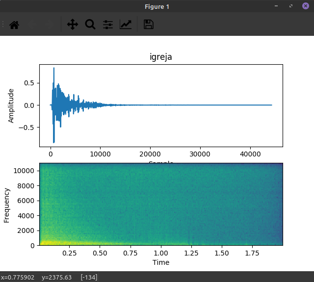
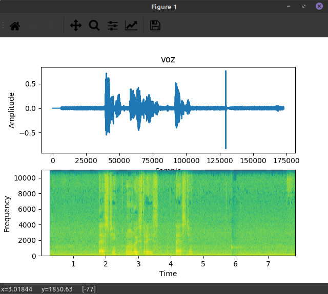
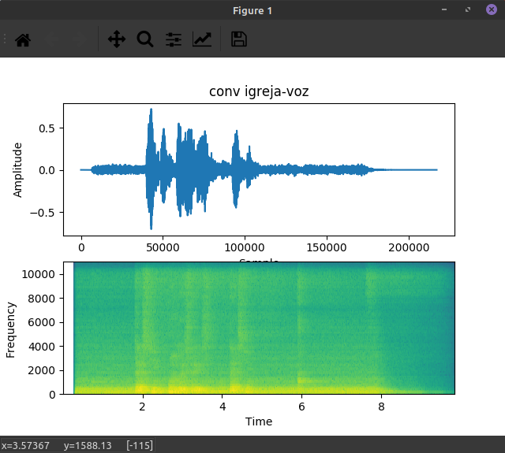

# Convolution-audio-python-test
(an easy way to understand convolution). A simple convolution of impulse response and voice audio. Numpy, librosa and matplotlib. Plotting the spectogram and signal. Listening to the audio is better to underst.

 

Resposta ao impulso gravado dentro de uma igreja:

 
Um áudio qualquer que será convoluído. Minha voz neste caso ;)

 
A convolução entre os dois áudios:

